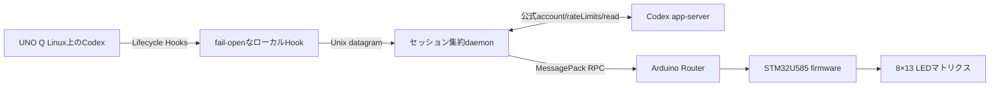

# UNO Q Codex Matrix

Arduino UNO Q上で動くOpenAI Codexの状態を、オンボード8×13青色LEDマトリクスへ表示します。

CodexのLifecycle Hookをローカルで観測して実機アニメーションへ変換するため、プロンプトや`AGENTS.md`にLED制御の指示を書く必要はありません。

[English](README.md) | [リリース](https://github.com/HSBL-ko-gyo/unoq-codex-matrix/releases) | [ドキュメント](#ドキュメント)

## デモ

READY、THINKING、TESTING、WAITING、SUCCESS、OFFLINEなど、CodexのLifecycle状態をマトリクスへ表示します。

`unoq-codex-matrix demo`を実行すると、利用可能な状態を順に表示した後、集約されたCodexセッションの状態へ戻ります。

## アーキテクチャ



Hookは応答を待たず、プライバシーを絞ったイベントを送信します。daemonはアクティブなセッションを集約し、Codex app-serverの公式アカウントAPIから残量を取得してRouter接続を管理します。MCU firmwareは選択された状態と残量バーを描画します。コンポーネントとtrust boundaryの詳細は[アーキテクチャ](docs/architecture.md)を参照してください。

## インストール

UNO Q上で実行します。

```bash
git clone https://github.com/HSBL-ko-gyo/unoq-codex-matrix.git
cd unoq-codex-matrix
sudo ./scripts/install.sh
```

インストーラーは次を行います。

- daemon、CLI、fail-open Hookをインストールする。
- 専用Python環境と初期設定を作成する。
- systemd serviceをインストールして有効化する。
- 無関係なhandlerを置き換えずに本プロジェクトのLifecycle Hookを追加する。
- matrix firmwareをcompile・flashし、demoと診断を実行する。

必要に応じて次のvariantを使用します。

```bash
sudo ./scripts/install.sh --no-flash
sudo ./scripts/install.sh --no-hooks
sudo ./scripts/install.sh --no-start
```

インストール後にCodexで`/hooks`を開き、`/usr/local/bin/unoq-codex-matrix-hook`の定義を確認してtrustしてください。`--dangerously-bypass-hook-trust`を常用設定にしないでください。

## 対応ハードウェアとソフトウェア

- STM32U585制御のオンボード8×13 LEDマトリクスを持つArduino UNO Q。
- systemdとArduino Routerが動くUNO Q Linux。
- Arduino UNO Q Zephyr coreを扱えるArduino CLI。
- `Arduino_LED_Matrix`と、firmware flash scriptが固定する`Arduino_RouterBridge` 0.4.3。
- Python 3.11以降。
- ユーザーLifecycle Hookに対応するCodex。
- 残量バーには`account/rateLimits/read`を持つCodex app-server。取得できない場合も状態表示は継続します。

実機で使用したversionは[検証履歴](docs/validation-history.md)に記録しています。

## 状態とアニメーション

状態IDはPythonとC++で共有するversioned wire ABIです。次表はユーザーに見える挙動の概要です。正確な値と描画定数のsource of truthは[プロトコル](docs/protocol.md)とfirmwareです。

| ID | 状態 | 主な契機 | マトリクス表示 |
|---:|---|---|---|
| 0 | OFF | CLI override | 消灯 |
| 1 | IDLE | セッション待機 | 静止した3点のREADY表示 |
| 2 | THINKING | prompt送信・処理再開 | 上昇するbubbleを伴う∞軌道comet |
| 3 | READING | 読取り・検索 | 縦方向のscan |
| 4 | WRITING | file編集 | 筆記cursorと軌跡 |
| 5 | COMMAND | その他のtool・shell処理 | 移動する矢印pulse |
| 6 | BUILDING | 認識したbuild command | 積み上がるblock |
| 7 | TESTING | 認識したtest command | progress表示 |
| 8 | FLASHING | firmware upload | 流れるdata列 |
| 9 | WAITING | PermissionRequest | 注意表示 |
| 10 | SUCCESS | turn完了 | 完了mark |
| 11 | ERROR | 明示的な構造化tool failure | error mark |
| 12 | OFFLINE | MCU heartbeat timeout | 切断表示 |
| 13 | SUBAGENT | subagent動作 | 独立して動くdot |

最下段の13灯はCodex残量バーです。短期枠と長期枠のうち残量が少ない方を、左から約7.7%ずつ表示します。右上indicatorは残量バーとは独立して追跡中の並行セッション数を示すため、両方を同時に表示できます。残量が未取得または古い場合は最下段のバーだけを消します。集約、優先順位、期限切れの仕様は[プロトコル](docs/protocol.md)を参照してください。

## CLI

```bash
unoq-codex-matrix status
unoq-codex-matrix demo
unoq-codex-matrix set thinking
unoq-codex-matrix set testing --seconds 15
unoq-codex-matrix set waiting
unoq-codex-matrix set success
unoq-codex-matrix set error
unoq-codex-matrix off
unoq-codex-matrix doctor
unoq-codex-matrix version
```

`status`はpromptやcommandを出力せず、daemon、Router、MCU、Codex残量取得、集約表示の状態を報告します。`demo`は全状態を順に表示します。`set`と`off`は一時的な表示overrideです。end-to-endの健全性確認には`doctor`を使用します。

## 設定

runtime設定は`/etc/unoq-codex-matrix/config.json`にあります。設定keyはbrightness、更新・heartbeat timing、状態の期限、アクティブセッション表示、残量バーとその更新・stale timing、log levelを制御します。[設定例](config/config.example.json)を基に編集し、daemonを再起動してください。

```bash
sudo systemctl restart unoq-codex-matrix.service
```

不正または範囲外の値は安全な既定値へ戻り、journalへ簡潔なwarningを出します。

## プライバシー

Hookは表示状態の選択と集約に必要な、allowlist済みLifecycle metadataだけを保持します。本プロジェクトはprompt本文、response本文、reasoning、command内容、file内容、diff、transcript、credential、Cookie、環境変数を保存・送信しません。

command本文はHook memory内で粗い活動categoryを選ぶためだけに確認し、その後破棄します。残量取得は公式Codex app-server経由で行い、このプロジェクト自身は認証fileやsession JSONLを読みません。通常logにsession identifierやapp-serverのerror本文を出さず、プロジェクト独自の外部telemetryもありません。data flowと保持契約は[プライバシー](docs/privacy.md)を参照してください。

## トラブルシュート

最初に次を実行します。

```bash
unoq-codex-matrix doctor
systemctl status unoq-codex-matrix.service --no-pager
systemctl status arduino-router.service --no-pager
journalctl -u unoq-codex-matrix.service -n 100 --no-pager
```

Hookが動かない場合は`/hooks`を開き、正確なcommandがtrust済みであることと、activeなCodex設定でHookが有効なことを確認します。daemonが`reconnecting`を報告する場合はArduino Routerのsocketとserviceを確認します。マトリクスがOFFLINEの場合はdaemon・Routerの健全性とfirmware protocol versionを確認します。

このプロジェクトはArduino Routerを介して通信するため、`/dev/ttyHS1`やMCUの`Serial1`を直接開かないでください。

## アンインストール

service、インストール済みcommand、専用環境、本プロジェクトのHook handlerだけを削除します。

```bash
sudo ./scripts/uninstall.sh
```

本プロジェクトの設定も削除する場合は`--purge`を付けます。無関係なpackage、log、Hook、MCU firmwareは変更しません。backup復元とfirmware recoveryは[ロールバック](docs/rollback.md)を参照してください。

## ドキュメント

- [アーキテクチャ](docs/architecture.md): コンポーネント、処理sequence、trust boundary。
- [プロトコル](docs/protocol.md): 状態ID、Hook input、集約、CLI、MCU RPC。
- [プライバシー](docs/privacy.md): input allowlist、除外data、保持、local access。
- [実機調査](docs/investigation.md): sanitize済みのdevice調査と互換性観測。
- [検証履歴](docs/validation-history.md): 時点を明記したhardware validation snapshot。
- [Remote試験](docs/remote-test.md): Remote起点Lifecycle Hookの確認手順。
- [ロールバック](docs/rollback.md): uninstall、backup復元、firmware recovery。
- [先行実装](docs/prior-art.md)と[third-party notices](THIRD_PARTY.md): 独立実装の記録とlicense。

version履歴とrelease時点の検証noteは[Releases](https://github.com/HSBL-ko-gyo/unoq-codex-matrix/releases)を参照してください。

## 開発

```bash
python3 -m venv .venv
. .venv/bin/activate
python -m pip install -e '.[dev]'
pytest
python -m compileall -q src tests
./scripts/build-native-hook.sh
arduino-cli compile -b arduino:zephyr:unoq firmware/unoq_codex_matrix
```

hardware uploadは通常開発と分離し、STM32 applicationを書き換えます。compile成功後、対象UNO Qにだけ`./scripts/flash-firmware.sh`を使用してください。contributionではfail-open Hook、privacy allowlist、protocol state ID、独立実装を維持してください。[CONTRIBUTING.md](CONTRIBUTING.md)も参照してください。

## Licenseと商標

MIT。非公式コミュニティプロジェクトであり、OpenAI、Codex、Arduinoとの提携・承認を示すものではありません。製品名と商標は各所有者に帰属します。
