# UNO Q Codex Matrix

Arduino UNO Q上で動くCodexの状態を、オンボード8×13青色LEDマトリクスへ自動表示します。

[English](README.md) | [アーキテクチャ](docs/architecture.md) | [プロトコル](docs/protocol.md) | [プライバシー](docs/privacy.md)

> [!IMPORTANT]
> 現在は **v0.1.0-alpha.1** です。実機UNO QでCodex 0.147.0のLifecycle event、ローカルHook/daemon経路、Router RPC、firmwareのcompile/upload、全状態demo、TTL、OFFLINE復帰、30分hardware soakを確認しました。スマートフォンRemote経由のHook、権限を伴うsystemd導入、全animationの実機目視確認は未完了です。安定版として扱う前に[実機調査結果](docs/investigation.md)を確認してください。

本プロジェクトはCodex本体から独立した観測レイヤーです。プロンプト、タスク、`AGENTS.md`へLED更新指示を書く必要はありません。短命Hookがプライバシーを絞ったローカルイベントを送り、daemonが複数セッションを集約し、STM32 firmwareがアニメーションを描画します。

## デモ

<!-- 目視検証後、このブロックを写真または短いループ動画へ置き換えます。 -->

> flash済み実機で全状態RPC demoを実行済みです。デモメディアと人によるanimation識別性の確認は未完了です。

実測ではpromptでTHINKING、認識対象のread toolでREADING、`apply_patch`でWRITING、認識対象のtest commandでTESTING、`Stop`でSUCCESSを保持してからIDLEへ戻りました。Codex 0.147.0は読取りをBash経由で行うことがあり、そのeventはshell本文から意図を推測せず、仕様どおりCOMMANDになります。

## アーキテクチャ

```mermaid
flowchart LR
    Phone["スマートフォンのChatGPT"] -->|"Remote"| Codex["UNO Q Linux上のCodex"]
    Codex -->|"Lifecycle Hooks"| Hook["unoq-codex-matrix-hook"]
    Hook -->|"Unix datagram<br/>events.sock"| Daemon["unoq-codex-matrixd"]
    Daemon --> Aggregate["複数セッション集約"]
    Aggregate -->|"MessagePack RPC"| Router["Arduino Router"]
    Router --> MCU["STM32U585 firmware"]
    MCU --> Matrix["8×13青色LEDマトリクス"]
```



Hookは応答待ち、再試行、ネットワーク接続を行いません。daemonが集約、TTL、Router再接続、heartbeat、CLI用control socketを担当します。firmwareのRPC callbackは固定長の値をpending領域へ設定するだけで、描画は`loop()`内で行います。

install時のprimary Hookは依存のないnative C実行ファイルです。既存C compilerがあればそれを使い、なければDebianのTCC/libc build fileをprivateな一時directoryへdownload・展開し、compiler packageをsystemへinstallせずにbuildします。native buildが完了できない場合だけ`jq`/`socat`版shell Hookをportable fallbackとして使用します。

v0.1のevent入力はLifecycle Hook経路だけです。`src/unoq_codex_matrix/sources.py`は`EventSource` protocolと具象`CodexHooksSource`を公開し、daemonは集約処理をtransportへ結合せず、この境界からeventを受け取ります。App ServerとCodex Micro HIDは将来の任意実験であり、v0.1のfallback parserではありません。

## 対応ハードウェアとソフトウェア

- STM32U585がオンボード8×13マトリクスを制御するArduino UNO Q。
- systemdと`arduino-router.service`が動くUNO Q Linux。
- FQBN `arduino:zephyr:unoq`を扱えるArduino CLI。
- Arduino UNO Q Zephyr core。調査機は`arduino:zephyr` 0.90.0。
- `Arduino_LED_Matrix`、および0.4.3へ固定した`Arduino_RouterBridge`。
- Python 3.11以降。調査機はPython 3.13.5。
- ユーザーLifecycle Hooks対応のCodex。実機probeには公式Linux ARM64版Codex 0.147.0を使用しました。

system Pythonへ`msgpack`をグローバル導入する必要はありません。インストーラーが専用virtual environmentを作り、宣言済み依存をそこへ導入します。

## 実機検証状況

alpha実機試験はDebian 13/AArch64、Arduino Router 0.9.0、`arduino:zephyr` 0.90.0、`Arduino_RouterBridge` 0.4.3で行いました。

- SessionStart、UserPromptSubmit、PreToolUse、PermissionRequest、PostToolUse、SubagentStart、SubagentStop、Stop、SessionEndを実測しました。PreCompact/PostCompactは無理に発生させていません。
- `arduino-cli`経由でSTM32U585 firmwareをcompile/uploadし、Router RPCでprotocol version 1とfirmware version 0.1.0を取得しました。
- 全state ID、brightness clamp、1,000回の高速state変更、SUCCESS/一時ERROR TTL、daemon再起動、heartbeat停止によるOFFLINEと復帰を確認しました。
- LED指示を含めない専用Codex smoke taskで、実際のpermission requestとsubagentを含むHook駆動の状態変化を確認しました。
- board上の既存高CPU負荷を維持したままlive daemonに対する最終native Hookを計測し、20回warmup後の200回でmedian 3.251 ms、p95 3.615 ms、最大5.540 msでした。socket不在時はp95 3.513 ms、dummy receiver稼働時はp95 3.543 msでした。
- GCC 14の`-Werror`、AddressSanitizer、UndefinedBehaviorSanitizerでnative integration test 47件、malformed random input 300件、Python referenceとのvalid differential 500件を通過しました。
- 1,801.2秒の連続hardware animation/RPC soakをRPC failureなしで完走し、途中でTHINKING、TESTING、OFFLINE、WRITING、WAITING、IDLEをsampleしました。
- 調査機では非対話の管理者権限を利用できなかったため、system serviceの導入は行っていません。権限設定を変更せず、daemonとcontrol socketを手動起動で検証しました。
- スマートフォンRemoteと、全animationを人が目視して区別できることは未確認です。

Codex 0.147.0で観測したBashと`apply_patch`の`tool_response`は文字列でした。本プロジェクトは本文中の「error」などを検索しないため、実際に失敗したBash commandではERRORへ遷移しませんでした。構造化した明示的failureのsynthetic試験では仕様どおり一時ERRORになります。このプライバシー優先の互換性制限もalphaである理由です。

## 5分で把握するインストール概要

UNO Q上で実行します。

```bash
git clone https://github.com/HSBL-ko-gyo/unoq-codex-matrix.git
cd unoq-codex-matrix
sudo ./scripts/install.sh
```

冪等なインストーラーは`/opt/unoq-codex-matrix/venv`を作成し、3つのコマンドを`/usr/local/bin`へ配置します。既存設定を保ったまま初期設定、systemd service、ユーザーHookを追加し、firmwareのcompile/upload後にdemoとdoctorを実行します。

オプション:

```bash
sudo ./scripts/install.sh --no-flash
sudo ./scripts/install.sh --no-hooks
sudo ./scripts/install.sh --no-start
```

`--no-flash`はLinux側だけを先にレビューするときに便利です。インストーラーはOS全体のupgrade、Router、ネットワーク、SSH、デスクトップ、kernel、bootloader、Git global設定を変更しません。

## Hookのレビューとtrust

[Codex Hooks公式ドキュメント](https://learn.chatgpt.com/docs/hooks)に従い、非managed command Hookは現在のhashをレビューしてtrustする必要があります。`arduino`ユーザーとして動くCodexで次を行います。

1. `/hooks`を開く。
2. `/usr/local/bin/unoq-codex-matrix-hook`を指すユーザーHookを探す。
3. コマンドと対象Lifecycle eventを確認する。
4. 定義をtrustし、通常の新しいタスクを開始する。

`--dangerously-bypass-hook-trust`を常用設定にしないでください。active configに`[features].hooks = false`がある場合は意図的に有効化し、再レビューします。インストーラーは同じユーザー層にinline `[hooks]`がなければ`~/.codex/hooks.json`を使用し、同一層の2形式を黙って混在させません。

## 状態とアニメーション

状態IDはPython/C++共通の固定wire ABIです。

| ID | 状態 | 主な契機 | アニメーション |
|---:|---|---|---|
| 0 | OFF | CLI override | 完全消灯 |
| 1 | IDLE | SessionStart、SUCCESS期限切れ | 中央の低輝度breathing dot |
| 2 | THINKING | prompt送信、tool完了、compact | 短い尾を持つ点が左右往復 |
| 3 | READING | read、grep、glob、search | 縦の走査線 |
| 4 | WRITING | `apply_patch`、Edit、Write | 蛇行する筆記cursorと軌跡 |
| 5 | COMMAND | その他のshell/tool | 右へ進む矢印pulse |
| 6 | BUILDING | 認識したbuild command | 下から積み上がるblock |
| 7 | TESTING | 認識したtest command | 往復するprogress bar |
| 8 | FLASHING | firmware upload command | 上から流れるdata列 |
| 9 | WAITING | PermissionRequest | 低速点滅する`?` |
| 10 | SUCCESS | `Stop` | check markが2回点滅後に保持 |
| 11 | ERROR | 明示的tool failure | Xが点滅後に弱点灯 |
| 12 | OFFLINE | MCU heartbeat timeout | 切断線と`!`の低速点滅 |
| 13 | SUBAGENT | SubagentStart | 3点が独立移動 |

右上の低輝度dot最大3個で、SessionEnd前の追跡中session数（IDLEまたはSUCCESSを保持中のsessionも含む）を示します。OFFとOFFLINEには表示しません。既定ではSUCCESSを8秒、tool ERRORを1.5秒表示します。別セッションの動作中状態はSUCCESSより優先されます。

## CLI

```bash
unoq-codex-matrix status
unoq-codex-matrix demo
unoq-codex-matrix set thinking
unoq-codex-matrix set testing --seconds 15
unoq-codex-matrix set waiting
unoq-codex-matrix set success
unoq-codex-matrix set error
unoq-codex-matrix off
unoq-codex-matrix doctor
unoq-codex-matrix version
```

`status`はdaemon、Router、MCU protocol、global state、追跡中session数、Hook/MCU RPC経過時間、brightness、firmware versionを表示します。session ID、prompt、commandは表示しません。`demo`は全状態を約2秒ずつ表示し、最後に短いIDLEを経てセッション集約状態へ戻ります。`off`は永続的な電源設定ではなく30秒間のoverrideです。`set`/`demo`の成功応答はdaemonがcontrol requestを受理したことを示すため、接続確認時は`status`または`doctor`とMCU RPC経過時間を併せて確認してください。

## 設定

`/etc/unoq-codex-matrix/config.json`:

```json
{
  "brightness": 3,
  "frame_interval_ms": 100,
  "heartbeat_interval_s": 3,
  "offline_timeout_s": 12,
  "success_hold_s": 8,
  "transient_error_s": 1.5,
  "stale_session_s": 43200,
  "show_active_count": true,
  "log_level": "INFO"
}
```

値は範囲検証されます。不在、不正、範囲外の値は安全な既定値へ戻り、journalへ短いwarningを出します。編集後は再起動してください。

```bash
sudo systemctl restart unoq-codex-matrix.service
```

## プライバシー

利用するのは次の情報だけです。

- Lifecycle event名。
- 粗いtool category/name。
- daemon memory内のsession、turn、tool-use識別子。
- 構造化された明示的success/failure。
- monotonic timestamp。

prompt、回答、reasoning、command本文、file内容、diff、transcript、credential、Cookie、環境変数を保存・送信しません。Bash commandはHook memory内でCOMMAND/BUILDING/TESTING/FLASHINGへ分類した直後に破棄します。通常logにsession IDを出しません。外部HTTP、MQTT、network telemetryはありません。詳細は[プライバシー設計](docs/privacy.md)を参照してください。

## トラブルシュート

```bash
unoq-codex-matrix doctor
systemctl status unoq-codex-matrix.service --no-pager
systemctl status arduino-router.service --no-pager
journalctl -u unoq-codex-matrix.service -n 100 --no-pager
```

`doctor`が検査するのは本プロジェクトの2 socket、Router socket、MCU RPC、protocol一致です。Hook trust、Codex feature設定、systemd unit内容、firmware upload履歴までは証明しないため、必要に応じて別途確認してください。

Hookが動かない場合は`/hooks`でexact commandのtrustを確認し、active configでHooksが無効化されていないか確認します。daemonが`reconnecting`ならRouter socketを確認し、`/dev/ttyHS1`やMCUの`Serial1`を直接開かないでください。OFFLINE表示ではdaemon/Routerとfirmware protocol versionを確認します。RemoteのtaskだけHookが発火しない場合は[Remote試験](docs/remote-test.md)に従い、session JSONL解析へ自動的に切り替えないでください。

ERROR表示には構造化された明示的failure fieldが必要です。`tool_response`を文字列だけで公開するCodex buildでは、失敗testがTESTINGからTHINKINGへ移り、一時ERRORが出ない場合があります。これはresponse本文を推測しないための意図した動作です。

## アンインストール

service、install済みcommand、virtual environment、本プロジェクトのHookだけを削除します。

```bash
sudo ./scripts/uninstall.sh
```

設定も明示的に削除する場合:

```bash
sudo ./scripts/uninstall.sh --purge
```

package、journal、既存Hookは削除せず、MCUを別sketchへ勝手に戻しません。backup復元とfirmware recoveryは[rollback](docs/rollback.md)を参照してください。

## 開発

```bash
python3 -m venv .venv
. .venv/bin/activate
python -m pip install -e '.[dev]'
pytest
python -m compileall -q src tests
./scripts/build-native-hook.sh
arduino-cli compile -b arduino:zephyr:unoq firmware/unoq_codex_matrix
```

実機試験はCIと分けます。uploadはSTM32 applicationを書き換えるため、compile成功後、対象UNO Q上でのみ`./scripts/flash-firmware.sh`を使用してください。contributionではfail-open Hook、privacy allow-list、Python/C++ state ID一致、独立実装を維持してください。[CONTRIBUTING.md](CONTRIBUTING.md)も参照してください。

## 先行実装

Hook/daemon分離やCodex Micro status deviceの6件を設計上参照しました。source codeはコピーしていません。GPLおよび明示licenseのない実装は挙動確認だけに用いました。[prior art](docs/prior-art.md)と[third-party notices](THIRD_PARTY.md)に詳細があります。

## ロードマップ

- smartphone Remoteから開始したturnのHook検証。
- 人によるanimation識別性の確認。
- 権限を伴う冪等install/uninstallとsystem boot時のservice試験。
- 再現可能なhardware test evidenceとdemo mediaの公開。
- 副作用のない観測が確認できた場合だけ`AppServerSource`を検討。
- `CodexMicroHidSource`はexperimentalのままdefault build外とする。

v0.1へ含めないもの: Vendor HID emulation、借用VID/PID、Web dashboard、public HTTP、MQTT、prompt/transcript logging、自動commit/PR。

## Licenseと商標

MIT。非公式コミュニティプロジェクトであり、OpenAI、Codex、Arduinoとの提携・承認を示すものではありません。製品名と商標は各所有者に帰属します。
