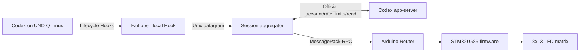

# UNO Q Codex Matrix

Show live OpenAI Codex activity on the Arduino UNO Q onboard 8x13 blue LED matrix.

Codex lifecycle Hooks are observed locally and translated into physical matrix animations without requiring prompts or `AGENTS.md` instructions for LED control.

[日本語](README.ja.md) | [Releases](https://github.com/HSBL-ko-gyo/unoq-codex-matrix/releases) | [Documentation](#documentation)

## Demo

The matrix reflects Codex lifecycle states such as READY, THINKING, TESTING, WAITING, SUCCESS, and OFFLINE.

Run `unoq-codex-matrix demo` to cycle through the available states and return the display to the aggregated Codex session state.

## Architecture



The Hook sends a privacy-reduced event without waiting for a response. The daemon aggregates active sessions, reads the remaining quota through the official Codex app-server account API, and owns Router connectivity; the MCU firmware renders the selected state and quota bar. See [Architecture](docs/architecture.md) for component and trust boundaries.

## Install

Run on the UNO Q:

```bash
git clone https://github.com/HSBL-ko-gyo/unoq-codex-matrix.git
cd unoq-codex-matrix
sudo ./scripts/install.sh
```

The installer:

- installs the daemon, CLI, and fail-open Hook;
- creates an isolated Python environment and initial configuration;
- installs and enables the systemd service;
- merges this project's lifecycle Hooks without replacing unrelated handlers; and
- compiles and flashes the matrix firmware, then runs the demo and diagnostics.

Use an install variant when needed:

```bash
sudo ./scripts/install.sh --no-flash
sudo ./scripts/install.sh --no-hooks
sudo ./scripts/install.sh --no-start
```

After installation, open `/hooks` in Codex, review the entries for `/usr/local/bin/unoq-codex-matrix-hook`, and trust the definitions. Do not use `--dangerously-bypass-hook-trust` as a persistent setting.

## Supported hardware and software

- Arduino UNO Q with its STM32U585-controlled onboard 8x13 LED matrix.
- UNO Q Linux with systemd and Arduino Router.
- Arduino CLI with the Arduino UNO Q Zephyr core.
- `Arduino_LED_Matrix` and `Arduino_RouterBridge` 0.4.3 (pinned by the firmware flash script).
- Python 3.11 or later.
- A Codex build that supports user lifecycle Hooks.
- Codex app-server with `account/rateLimits/read` for the quota bar. State display continues when quota data is unavailable.

Known tested versions are recorded in [validation history](docs/validation-history.md).

## States and animations

State IDs are a versioned wire ABI shared by Python and C++. This table describes user-visible behavior; [the protocol](docs/protocol.md) and firmware are the sources of truth for exact values and rendering constants.

| ID | State | Typical trigger | Matrix animation |
|---:|---|---|---|
| 0 | OFF | CLI override | Display off |
| 1 | IDLE | Session ready | Static three-dot READY indicator |
| 2 | THINKING | Prompt or processing resumed | Infinity-path comet with rising bubbles |
| 3 | READING | Read or search activity | Vertical scan |
| 4 | WRITING | File edit | Writing cursor and trail |
| 5 | COMMAND | Other tool or shell activity | Moving arrow pulse |
| 6 | BUILDING | Recognized build command | Stacking blocks |
| 7 | TESTING | Recognized test command | Progress-style animation |
| 8 | FLASHING | Firmware upload command | Falling data streams |
| 9 | WAITING | Permission request | Pulsing question mark |
| 10 | SUCCESS | Completed turn | Completion mark |
| 11 | ERROR | Explicit structured tool failure | Error mark |
| 12 | OFFLINE | MCU heartbeat timeout | Disconnected indicator |
| 13 | SUBAGENT | Subagent activity | Independently moving dots |

The 13 LEDs in the top row form the Codex quota bar. It uses the lower remaining value across the short and long quota windows and fills from left to right in roughly 7.7% steps. The optional lower-right indicator independently shows concurrent tracked sessions, so both can remain visible. If quota data is unavailable or stale, only the top bar disappears. Aggregation, precedence, and expiry semantics are defined in [the protocol](docs/protocol.md).

## CLI

```bash
unoq-codex-matrix status
unoq-codex-matrix demo
unoq-codex-matrix set thinking
unoq-codex-matrix set testing --seconds 15
unoq-codex-matrix set waiting
unoq-codex-matrix set success
unoq-codex-matrix set error
unoq-codex-matrix off
unoq-codex-matrix doctor
unoq-codex-matrix version
```

`status` reports daemon, Router, MCU, Codex quota-source, and aggregated display state without printing prompts or commands. `demo` cycles through every state. `set` and `off` provide temporary display overrides. Use `doctor` for an end-to-end health check.

## Configuration

Runtime configuration lives at `/etc/unoq-codex-matrix/config.json`. The supported keys control brightness, update and heartbeat timing, state expiry, active-session indicators, quota display and refresh/stale timing, and log level. Start from [the configuration example](config/config.example.json), then restart the daemon after editing:

```bash
sudo systemctl restart unoq-codex-matrix.service
```

Invalid or out-of-range values fall back to safe defaults and produce a concise journal warning.

## Privacy

The Hook retains only allowlisted lifecycle metadata needed to select and aggregate a display state. Prompt text, response text, reasoning, command contents, file contents, diffs, transcripts, credentials, cookies, and environment variables are not stored or transmitted by this project.

Command text is inspected only in Hook memory to select a coarse activity category and is then discarded. Quota reads use the official Codex app-server; this project does not read authentication files or session JSONL. Normal logs omit session identifiers and app-server error bodies, and the project has no independent external telemetry. See [Privacy](docs/privacy.md) for the data-flow and retention contract.

## Troubleshooting

Start with:

```bash
unoq-codex-matrix doctor
systemctl status unoq-codex-matrix.service --no-pager
systemctl status arduino-router.service --no-pager
journalctl -u unoq-codex-matrix.service -n 100 --no-pager
```

If Hooks do not run, inspect `/hooks`, verify the exact command is trusted, and confirm Hooks are enabled in the active Codex configuration. If the daemon reports `reconnecting`, check the Arduino Router socket and service. If the matrix shows OFFLINE, check daemon/Router health and the firmware protocol version.

Do not open `/dev/ttyHS1` or use MCU `Serial1` directly; this project communicates through Arduino Router.

## Uninstall

Remove the service, installed commands, private environment, and only this project's Hook handlers:

```bash
sudo ./scripts/uninstall.sh
```

Add `--purge` to remove the project configuration. The uninstaller leaves unrelated packages, logs, Hooks, and MCU firmware untouched. See [Rollback](docs/rollback.md) for backup restoration and firmware recovery.

## Documentation

- [Architecture](docs/architecture.md): components, sequences, and trust boundaries.
- [Protocol](docs/protocol.md): state IDs, Hook input, aggregation, CLI, and MCU RPC.
- [Privacy](docs/privacy.md): input allowlist, excluded data, retention, and local access.
- [Investigation](docs/investigation.md): sanitized device research and compatibility observations.
- [Validation history](docs/validation-history.md): point-in-time hardware validation snapshots.
- [Remote test](docs/remote-test.md): procedure for checking Remote-originated lifecycle Hooks.
- [Rollback](docs/rollback.md): uninstall, backup restoration, and firmware recovery.
- [Prior art](docs/prior-art.md) and [third-party notices](THIRD_PARTY.md): independent-design record and licenses.

See [Releases](https://github.com/HSBL-ko-gyo/unoq-codex-matrix/releases) for version history and release validation notes.

## Development

```bash
python3 -m venv .venv
. .venv/bin/activate
python -m pip install -e '.[dev]'
pytest
python -m compileall -q src tests
./scripts/build-native-hook.sh
arduino-cli compile -b arduino:zephyr:unoq firmware/unoq_codex_matrix
```

Hardware upload is separate from normal development and changes the STM32 application. Use `./scripts/flash-firmware.sh` only on the intended UNO Q after compilation succeeds. Contributions must preserve the fail-open Hook, privacy allowlist, protocol state IDs, and independent implementation. See [CONTRIBUTING.md](CONTRIBUTING.md).

## License and trademarks

MIT. This is an unofficial community project and is not affiliated with or endorsed by OpenAI, Codex, or Arduino. Product names and trademarks belong to their respective owners.
