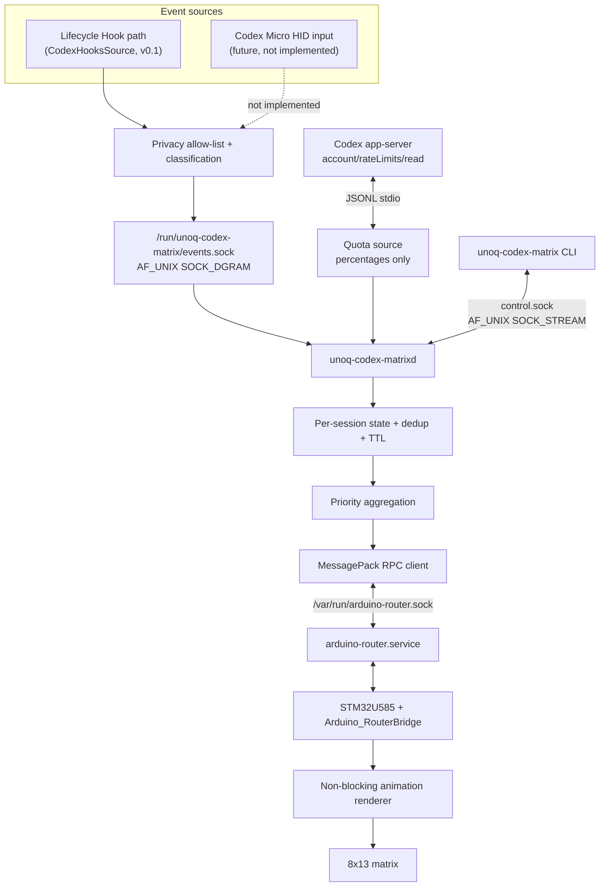
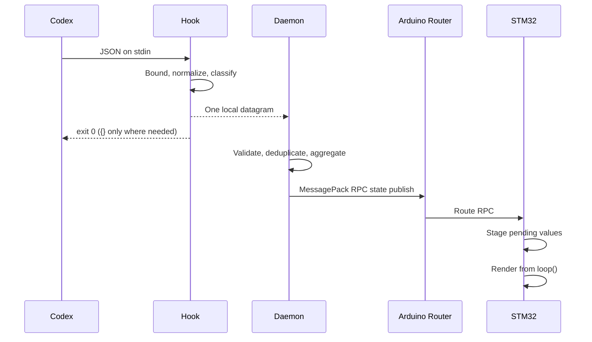
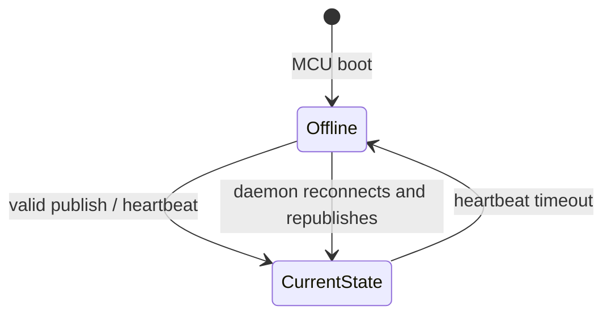

# Architecture

## Status

This document describes the v0.1 protocol and implementation. The repository is currently `0.1.0a1`. The local Codex Hook path, daemon, Router RPC, flashed STM32 firmware, state TTLs, heartbeat recovery, and a 30-minute hardware soak have been exercised end to end on an UNO Q. Phone-originated Remote behavior, privileged service installation, and human visual review remain pending. See [investigation.md](investigation.md).

## Design goals

- Observe Codex without putting display instructions in prompts or repository guidance.
- Keep the synchronous Hook short, bounded, local, and fail-open.
- Never move prompt, response, reasoning, command, diff, transcript, path, or credential data across the observer boundary.
- Aggregate concurrent Codex sessions deterministically.
- Use the official Arduino Router path instead of claiming `/dev/ttyHS1` or MCU `Serial1`.
- Keep RPC callbacks bounded and render animations from the normal Arduino loop.
- Recover automatically when the daemon, Router, or MCU restarts.

## Components



`sources.py` defines a runtime-checkable `EventSource` protocol and the concrete
`CodexHooksSource`, which owns the bounded Unix datagram receiver. The daemon
depends on that protocol. `quota.py` is a separate, read-only account-metadata
source; it does not observe turns or implement `EventSource`. A future App
Server event or HID implementation would still have to satisfy the normalized
event boundary and privacy policy.

### Hook client

`unoq-codex-matrix-hook` reads at most 64 KiB plus one sentinel byte from standard input. It decodes one JSON object, converts it into the smaller protocol-v1 allow-list, and sends one datagram of at most 4 KiB. It then exits.

The installed primary implementation is the dependency-free native C Hook in
`native/`. Its bounded JSON scanner and quote-aware command tokenizer do not try
to implement a complete shell parser. `hook.py` is the Python reference used for
differential testing. The shell implementation is retained only as a portable
fallback if the install-time native build cannot complete.

The Hook uses a non-blocking Unix datagram socket. It does not wait for a response, retry, connect to IP networking, start the daemon, or write a log. A missing or busy socket, malformed input, and internal exceptions are ignored. The normal exit status is zero. `Stop` and `SubagentStop` emit the inert JSON object `{}` on stdout.

Although Codex supports background Hooks, correctness and latency do not depend on `async` configuration. [Official Hooks documentation](https://learn.chatgpt.com/docs/hooks) says synchronous command Hooks normally delay the triggering operation, which is why this process is deliberately minimal.

### Privacy normalization

Only the following fields can enter `NormalizedEvent`:

- protocol version and normalized event category;
- session, turn, and tool-use identifiers;
- bounded tool name;
- coarse state and explicit failure boolean;
- local monotonic timestamp.

The datagram decoder rejects every unknown field, rather than silently carrying it forward. Bash input is held only long enough to classify build, test, flash, or other command activity. `tool_response` is consulted only for structured failure fields and is never placed in an event.

### Daemon

`unoq-codex-matrixd` owns both runtime sockets and all mutable observer state. Its responsibilities are:

- validate and rate-limit malformed datagram logging;
- discard unsupported protocol versions and timestamps outside the accepted window;
- deduplicate `(session, turn, tool_use, event)`;
- ignore older per-session events that would roll state backward;
- expire SUCCESS, transient ERROR, and stale sessions;
- select one global state across concurrent sessions;
- poll the official Codex app-server quota method on a background thread and
  retain only bounded remaining percentages;
- publish a complete state and heartbeat to the MCU;
- retry Router access without terminating;
- serve bounded local CLI requests;
- handle SIGTERM/SIGINT and remove its sockets.

The supplied service definition runs as `User=arduino`, with
`NoNewPrivileges`, `PrivateTmp`, AF_UNIX/AF_INET/AF_INET6 restricted address
families, and a systemd-managed runtime directory. IP families are needed only
by the child Codex app-server for its official account request. The investigated
board used a manual
unprivileged launch because administrative installation access was unavailable.

### Session aggregation

Each session stores:

```text
session_id
turn_id
current_state
previous_state
updated_monotonic_ns
tool_use_id
completion_expiry_ns
transient_error_expiry_ns
```

The display priority is:

```text
ERROR > WAITING > FLASHING > TESTING > BUILDING > WRITING >
READING > COMMAND > SUBAGENT > THINKING > SUCCESS > IDLE
```

OFFLINE is a transport/firmware condition and outranks session states when explicitly represented. OFF is a manual display override, not a Codex session state. Ties are resolved by the most recently updated session.

SUCCESS becomes IDLE after 8 seconds by default. A PostToolUse event with an explicit structured failure shows ERROR for 1.5 seconds and then returns to THINKING so Codex can continue repairing the task. `SessionEnd` removes the active session record, but a content-free completion lease keeps a prior SUCCESS visible until its original expiry. A bounded in-memory tombstone records the ended session and event time so a delayed datagram cannot resurrect it; tombstones and deduplication keys expire at the stale-session TTL or their capacity limit. They are never logged or persisted. A session silent for 12 hours is removed. A working session therefore remains visible even if another session has just completed.

The active-session count is the number of tracked, non-ended session records. It
can include an IDLE or SUCCESS record until `SessionEnd` or stale expiry; it is
not a count of CPU-busy tasks.

### Router bridge

The daemon opens only `/var/run/arduino-router.sock`. The official [Arduino Router](https://github.com/arduino/arduino-router) is a MessagePack-RPC star router and supports multiple Linux clients. Direct access to `/dev/ttyHS1` and STM32 `Serial1` is prohibited because those resources belong to the Router.

Every publish sends the complete state, active-session count, animation timing,
offline timeout, count-dot option, brightness, quota visibility/percentage when
firmware supports it, and heartbeat. Status and version are read back and
protocol version 1 is checked. Firmware before 0.2.0 keeps the original publish
path and simply omits the quota overlay. A transport, timeout, MessagePack, or
RPC-envelope failure closes the client connection. A rejected or semantically
invalid result is reported without guaranteeing that the persistent socket is
closed. In either case the daemon waits two seconds before a later publish
attempt and keeps running while the Router or MCU is unavailable.

### Firmware

Firmware uses `Arduino_LED_Matrix` in 3-bit grayscale mode and `Arduino_RouterBridge`. The following functions are exposed with `Bridge.provide_safe()`:

```text
codex_matrix_set_state
codex_matrix_heartbeat
codex_matrix_get_status
codex_matrix_set_brightness
codex_matrix_set_quota
codex_matrix_get_version
codex_matrix_get_render_metrics
```

Callbacks perform bounded plain-data updates only. `loop()` applies pending values, checks heartbeat age with unsigned subtraction, chooses OFFLINE when necessary, and draws at the configured 50–150 ms interval. No dynamic allocation or long `delay()` occurs in the animation loop. Normal project brightness is capped at 5 even though the matrix supports grayscale levels 0–7. When current quota data is visible, the bottom row is cleared and redrawn as a left-to-right 13-segment bar after the state animation, so it remains stable through fades and transitions. The upper-right active-session dots remain independently visible.

At boot, firmware renders OFFLINE. A valid state publish also counts as a heartbeat. When heartbeats resume after a timeout or restart, the latest complete publish restores the daemon-selected state.

## Runtime sequences

### Lifecycle event



### Transport loss and recovery



## Local trust boundaries

| Boundary | Transport | Limit | Data policy |
|---|---|---:|---|
| Codex to Hook stdin | inherited pipe | 64 KiB | Raw only inside one short process |
| Hook to daemon | AF_UNIX datagram | 4 KiB | Strict normalized allow-list |
| Daemon to Codex app-server | inherited stdio, JSONL | one response at a time | Read-only rate-limit request; retain percentages only |
| Codex app-server to OpenAI | app-server-managed HTTPS | Codex-managed | Official account quota request; no project endpoint |
| CLI to daemon | AF_UNIX stream, JSON line | 8 KiB | Status and manual control only |
| Daemon to Router | AF_UNIX stream, MessagePack RPC | 4 KiB client buffer | Numeric state/config/status only |
| Router to MCU | Router-managed transport | Router/Bridge managed | Numeric protocol only |

There is no externally reachable server and no project-owned network endpoint.
Socket modes are `0660` inside a systemd runtime directory with mode `0750`.

## Event-source extension rule

A future event source must output the same privacy-reviewed `NormalizedEvent` and must not broaden daemon responsibilities. The current app-server client reads only account quota metadata; App Server turn observation remains separate and will be considered only if a second client can observe the same turn without changing the existing server or task. Codex Micro HID remains experimental because its host-selected six-slot colors do not expose Lifecycle event names or detailed tool categories, and v0.1 explicitly excludes HID identity emulation.

## Real-device evidence and known alpha gaps

Codex 0.147.0 produced SessionStart, UserPromptSubmit, PreToolUse,
PermissionRequest, PostToolUse, SubagentStart, SubagentStop, Stop, and SessionEnd
on the local CLI path. PreCompact and PostCompact were not forced. The firmware
compiled and uploaded, all numeric states were sent over Router RPC, 1,000 rapid
updates completed, and a heartbeat lapse selected OFFLINE before daemon recovery
restored IDLE.

The observed Bash and `apply_patch` `tool_response` values were strings. Since
the Hook does not search response prose, a failing real Bash test cannot be
classified ERROR without a future explicit field from Codex; structured test
fixtures verify the ERROR path itself.

The hardware soak ran continuously for 1,801.2 seconds without an RPC failure.
Its five-minute samples covered THINKING, TESTING, OFFLINE, WRITING, WAITING,
and IDLE.

The remaining alpha gaps are:

- phone-originated Remote Hook behavior;
- privileged systemd installation and boot-time operation;
- human confirmation that every animation is visually distinct, plus demo
  media.

App Server turn attachment remains deliberately out of scope for v0.1 rather
than a release-validation gap. The quota-only account request does not attach
to turns. The pre-project STM32 application was not identifiable or backed up.
