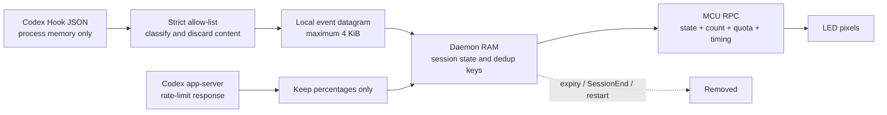

# Privacy design

## Summary

UNO Q Codex Matrix is a local activity indicator, not a transcript recorder.
The Hook reduces a Codex lifecycle payload to a fixed allow-list, sends it over a
local Unix datagram, and immediately exits. The daemon keeps identifiers and
state only in memory. The MCU receives only a numeric display state, aggregate
session count, a bounded remaining-quota percentage, display settings, and
heartbeat/version data.

There is no public HTTP server, dashboard, MQTT client, analytics service, or
project-owned network endpoint. The optional quota source asks the official
Codex app-server to perform its normal authenticated account-rate-limit read.

## Data used

The observer uses only:

- lifecycle event name;
- coarse tool name/category needed for display classification;
- session, turn, and tool-use identifiers for in-memory aggregation, ordering,
  and duplicate suppression;
- explicit structured success/failure fields;
- monotonic event time;
- Codex primary/secondary `usedPercent` values reduced to the most restrictive
  remaining percentage; and
- derived state, active-session count, and non-sensitive display settings.

For a shell tool only, the Hook inspects the command string in its own memory to
classify it as COMMAND, BUILDING, TESTING, or FLASHING. It then discards the
string. The command is not placed in the normalized event.

For a completed tool, the Hook inspects only structured failure indicators such
as a non-zero exit code, `status == failed`, `success == false`, or an explicit
tool-error field. It does not search response prose for words such as “error.”

## Data excluded

The normalized event, daemon state, CLI status, logs, and MCU RPC never include:

- prompts or user messages;
- assistant answers or `last_assistant_message`;
- reasoning text;
- command text or complete tool input;
- tool-response bodies;
- file contents or diffs;
- working directory or transcript path;
- transcript/session JSONL content;
- environment variables;
- API keys, cookies, authentication files, or SSH material; or
- Codex credentials of any kind.

The project never reads `~/.codex/auth.json`. Install and diagnostic scripts must
check only what they need and must never print, copy, or add that file to Git.
The project also never parses Codex session JSONL. Codex app-server owns account
authentication and upstream requests; this project communicates with it only
through initialized JSONL stdio and a read-only quota method.

## Data flow and retention

- Raw stdin is bounded to 65,536 bytes and is never logged or written to disk.
- The normalized datagram is bounded to 4,096 bytes and has exactly the fields
  documented in [protocol.md](protocol.md).
- Active session records are removed on `SessionEnd` or after the configured
  stale-session TTL (12 hours by default). A content-free completion lease can
  retain SUCCESS for its original eight-second display TTL after SessionEnd.
- Duplicate identities and SessionEnd tombstones are retained only in bounded
  in-memory sets until the stale-session TTL or their capacity limit. They
  prevent duplicate transitions and delayed datagrams from resurrecting an
  ended session; they are never logged or persisted.
- All session, completion, deduplication, and tombstone metadata is lost when
  the daemon restarts.
- MCU RPC carries no session, turn, or tool-use identifier.
- Quota snapshots contain only primary, secondary, and selected remaining
  percentages plus a local monotonic update time. A snapshot stops being
  displayable after `quota_stale_after_s` and all quota state is lost on daemon
  restart.
- No database or event-history file is created.

## Logs and CLI

Normal journal messages are limited to startup, bounded validation warnings,
Router connectivity, and shutdown/health information. They omit session IDs,
turn IDs, tool-use IDs, prompts, commands, response content, raw datagrams, and
app-server error bodies. Error bodies are
discarded because an upstream failure can include account-linked response data.
Debug log level does not enable raw payload recording.

`unoq-codex-matrix status` and `doctor` expose an aggregate state, counts,
selected remaining percentage, quota-source category, version/health data, and
event/RPC ages. They never return an identifier or content field. An age value
is operational telemetry, not an event history.

## Local access boundaries

- `/run/unoq-codex-matrix` is created by systemd with mode `0750`.
- `events.sock` is a Unix datagram socket and `control.sock` is a Unix stream
  socket; both are created with mode `0660`.
- The daemon runs as the unprivileged `arduino` user with
  `NoNewPrivileges=true` and `PrivateTmp=true`.
- Hook-to-daemon communication never uses TCP/IP.
- The systemd unit permits AF_INET/AF_INET6 only so the child Codex app-server
  can perform the official account quota request. The daemon exposes no IP
  listener.
- Router communication is local to `/var/run/arduino-router.sock` and contains
  only the display RPC described above.

These controls reduce accidental access; they do not make the LED a secret
channel. Anyone who can see the board can infer coarse activity such as testing,
waiting, success, or failure. The display intentionally cannot reveal task
content.

## Fixtures and diagnostics

The real-device Codex 0.147.0 Hook probe has completed. A privacy-reviewed set of
representative records is stored in
`tests/fixtures/hooks/codex-0.147.0-uno-q.jsonl`. Each record contains only:

- Hook event name and event time;
- tool name/category;
- a one-way hash of at most the first eight identifier characters; and
- the tool-response value's type, never its body.

The committed fixture contains no raw payload or full identifier. The observed
Bash and `apply_patch` response values were strings; only that type name was
retained. Their bodies were neither copied nor used to infer failure. As a
result, an actual failed Bash test on this Codex build did not select ERROR,
while a synthetic event with an explicit structured failure field did. This is
the intended privacy boundary.

Before adding or replacing a fixture, run the privacy check and manually inspect
it. Do not commit the probe's raw stdin, transcript path, working directory,
command, prompt, answer, environment, identifiers, or journal export. A fixture
that cannot be confidently sanitized must be discarded.

## Future event sources

Only the lifecycle-Hook event input path is enabled in v0.1. The daemon's
runtime-checkable `EventSource` protocol is implemented by the concrete
`CodexHooksSource`. The app-server quota client is account metadata, not an
event source. A future App Server turn or HID source must implement the same
bounded transport interface, produce the same reduced internal event, and pass
the same privacy tests.
Absence of a Remote Hook is not permission to begin parsing session JSONL or
recording transcripts by default.

## Reporting a privacy issue

Do not paste a suspected secret into a public issue. Follow
[SECURITY.md](../SECURITY.md), rotate an exposed credential through its owner if
necessary, and remove it from both the working tree and Git history before any
public release.
